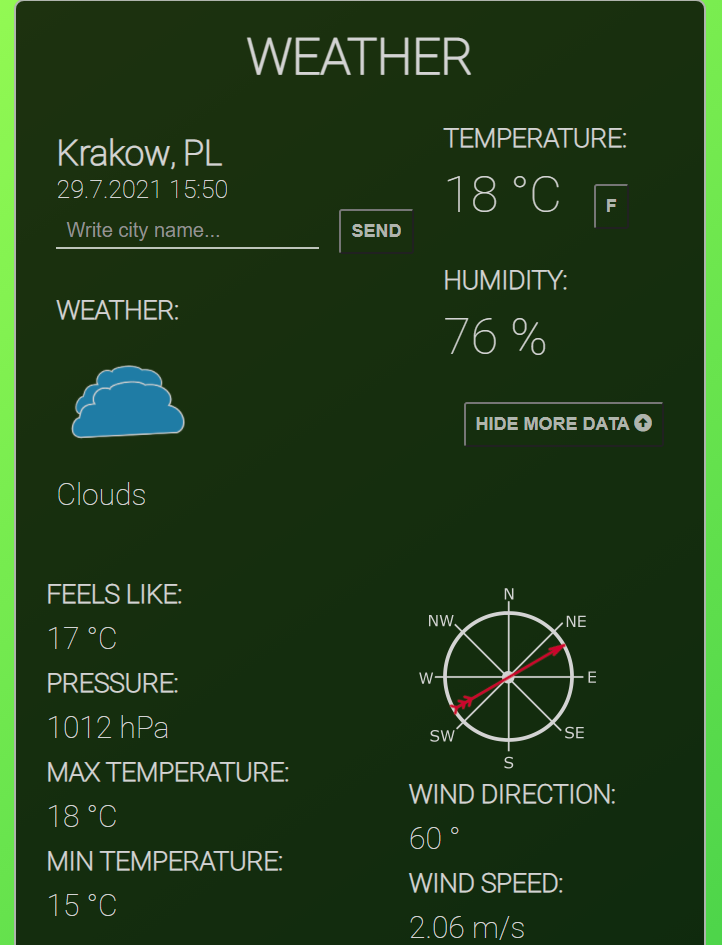

# Weather APP

## Description 

Weather web widget using openweather API: https://openweathermap.org/api

## Usage 

- Get api key for https://openweathermap.org/api or adjust the app for another API.

- If you use the openweather API, you paste your api key in the appropriate place in the script.js file:

```js
/* insert your api key for openweathermap */
const apiKey = '&appid=........................';
```
## Technologies/Tools 

- Java Script
- HTML
- CSS
- Axios
- Openweather API https://openweathermap.org/api
- Google fonts
- fontawesome https://fontawesome.com

